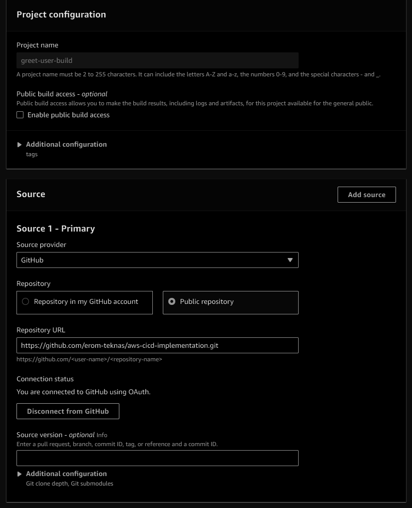
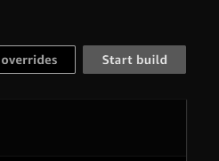
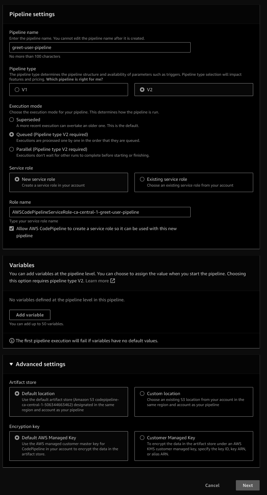
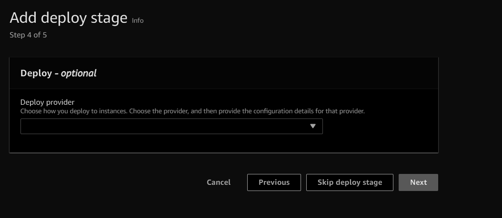
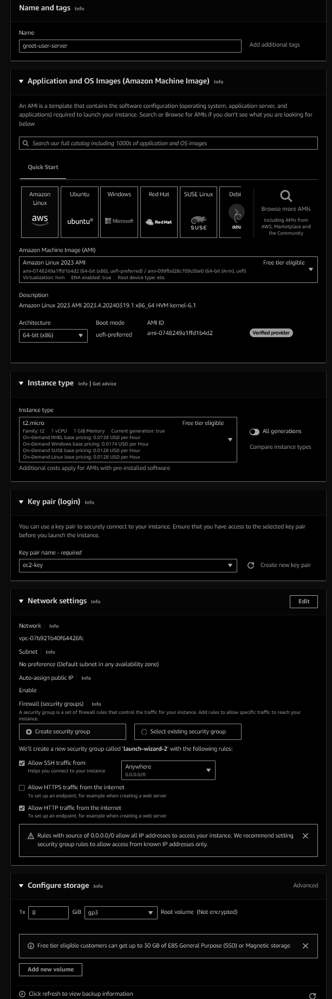
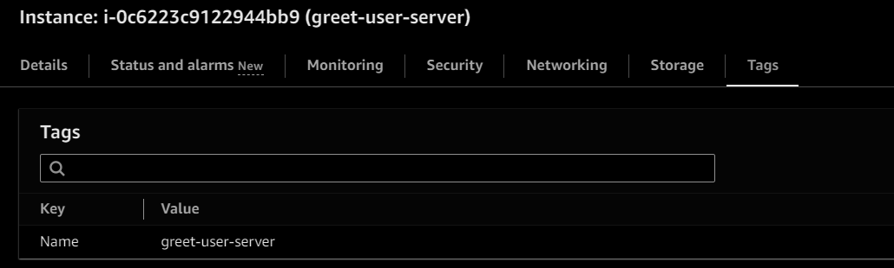
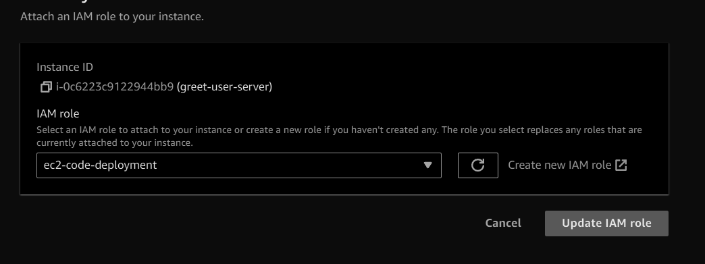
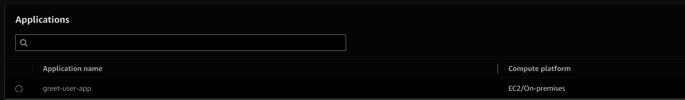
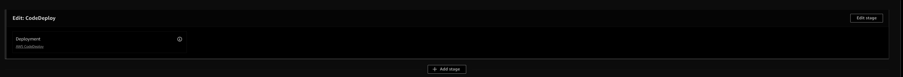

# CI/CD Pipeline for Python Flask Application Deployment 🚀

This document demonstrates a complete CI/CD setup for deploying a Python Flask application as a Docker container on EC2 instances using AWS services like CodeBuild, CodeDeploy, and CodePipeline.

## Overview 📝

This project provides a step-by-step guide and configuration files to set up a continuous integration and continuous deployment (CI/CD) pipeline for a Python Flask application hosted on GitHub. The pipeline automatically builds the Docker image, deploys it to AWS EC2 instances, and updates the application running in the Docker container whenever changes are pushed to the GitHub repository.

{: width="700" height="400" .shadow .light }
{: width="700" height="400" .shadow .dark }

## Features ✨

- Automates the build and deployment process for your Python Flask application.
- Utilizes Docker for containerization, ensuring consistency across different environments.
- Uses AWS CodeBuild for building the Docker image.
- Leverages AWS CodeDeploy for deploying the Docker container to EC2 instances.
- Orchestrates the entire CI/CD workflow with AWS CodePipeline.
- Easily customizable and extensible to suit your project's needs.

## Prerequisites 🛠️

Before getting started, make sure you have the following prerequisites installed and configured:

- AWS Account with permissions to create IAM roles, EC2 instances, CodeBuild projects, CodeDeploy applications, and CodePipeline pipelines.
- GitHub Repository containing your Python Flask application code.
- Docker installed locally for building and testing Docker images.
- Basic knowledge of Docker, Python Flask, AWS services, and CI/CD concepts.

## Setup Instructions 🚧
### 1. Configure AWS CodeBuild, CodePipeline and CodeDeploy
- 🛠️ Go to the AWS Management Console and navigate to CodeBuild.
- 🏗️ Create a new CodeBuild project as per the below screenshot and configure using `buildspec.yml`.
{: width="700" height="400" .shadow .light }
{: width="700" height="400" .shadow .dark }
- ⚙️ Click on start build on the code project and test if the builds are getting created.
{: width="700" height="400" .shadow .light }
{: width="700" height="400" .shadow .dark }
- 🚀 Now let's configure CodePipeline and create a new pipeline.
{: width="700" height="400" .shadow .light }
{: width="700" height="400" .shadow .dark }
- 🔄 Add the source stage in the pipeline and add GitHub connections so that the changes in the repository trigger the pipeline (Note: Select make a full clone option).
{: width="700" height="400" .shadow .light }
{: width="700" height="400" .shadow .dark }
- 🛠️ Add the above-created build as the build stage with provider as AWS CodeBuild and select the build project name that created.
{: width="700" height="400" .shadow .light }
{: width="700" height="400" .shadow .dark }
- 🚫 Skip the CodeDeploy stage configuration initially and create the pipeline.
{: width="700" height="400" .shadow .light }
{: width="700" height="400" .shadow .dark }
- 🏭 Let's create the target EC2 instance where we want to deploy the application and tag it with some unique identifier and attach IAM policy.
{: width="700" height="400" .shadow .light }
{: width="700" height="400" .shadow .dark }
{: width="700" height="400" .shadow .light }
{: width="700" height="400" .shadow .dark }
{: width="700" height="400" .shadow .light }
{: width="700" height="400" .shadow .dark }
- 🛡️ Now, to deploy the change to the target EC2, it's required to deploy the CodeDeploy agent (Note: Connect to EC2 and deploy manually instruction [here](https://docs.aws.amazon.com/codedeploy/latest/userguide/codedeploy-agent-operations-install-cli.html)).

```sh
sudo yum update
sudo yum install ruby
sudo yum install wget
wget https://aws-codedeploy-ca-central-1.s3.ca-central-1.amazonaws.com/latest/install
chmod +x ./install
sudo ./install auto
systemctl start codedeploy-agent
systemctl status codedeploy-agent
```
- 📦 Let's now work on the CodeDeploy section.
{: width="700" height="400" .shadow .light }
{: width="700" height="400" .shadow .dark }
- 🎯 Create a deployment group, i.e., attach the target EC2, so that the CodeDeploy knows the target.
{: width="700" height="400" .shadow .light }
{: width="700" height="400" .shadow .dark }
- ➕ Add this as a code deploy stage to CodePipeline
{: width="700" height="400" .shadow .light }
{: width="700" height="400" .shadow .dark }
- ✅ That's it try running the code pipeline by committing the change in the GitHub repo.
{: width="700" height="400" .shadow .light }
{: width="700" height="400" .shadow .dark }
{: width="700" height="400" .shadow .light }
{: width="700" height="400" .shadow .dark }
### 2. IAM Role Configuration (Points to remember)
- 🤝 Create an IAM role with permissions required for CodePipeline, CodeBuild, and CodeDeploy.
- 📜 Attach the IAM role to your pipeline and EC2 instances.

### 3. Testing (Points to remember)
- 🧪 Make a test commit to a branch matching the pattern `digit.digit-rc` to trigger the pipeline.
- ✅ Ensure the pipeline completes successfully and the changes are deployed to your EC2 instances.
- 🔒 Make sure that the port 5000 is enabled on the target EC2 instance.

## Resources 📚

- [AWS CodeBuild Documentation](https://docs.aws.amazon.com/codebuild/)
- [AWS CodeDeploy Documentation](https://docs.aws.amazon.com/codedeploy/)
- [AWS CodePipeline Documentation](https://docs.aws.amazon.com/codepipeline/)

## Acknowledgements 🙏

Special thanks to the amazing communities of GitHub, Docker, Flask, and AWS for their fantastic tools and resources.

Happy coding! 🎉

## GITHUB Repository 
[GITHUB](https://github.com/erom-teknas/aws-cicd-implementation)
