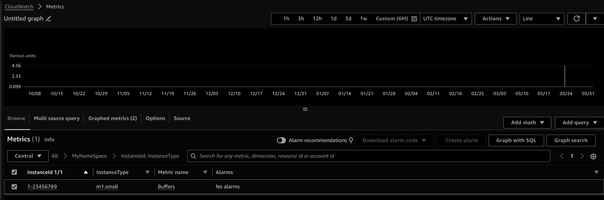
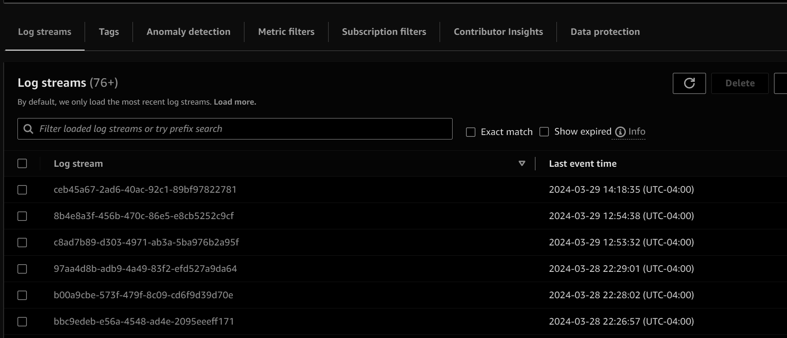
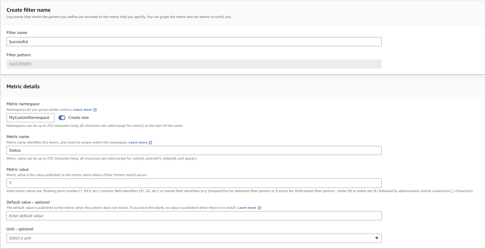
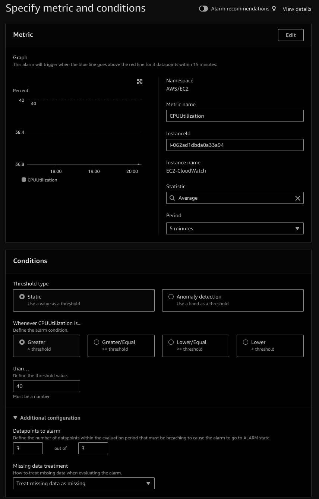
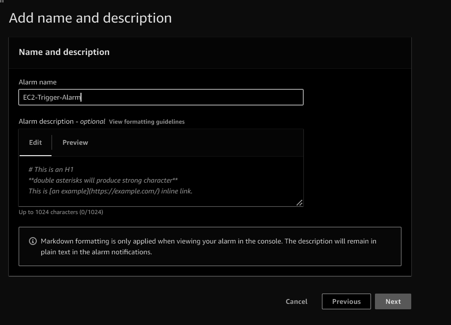
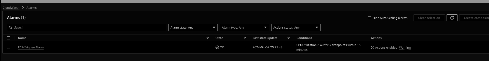
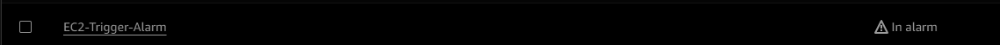

# 🔍 Exploring the Power of AWS Monitoring
Discover the capabilities and benefits of AWS CloudWatch, AWS X-Ray and AWS CloudTrail for comprehensive monitoring and observability of your AWS infrastructure and applications.


## AWS CloudWatch 🌟

### Metrics 📊
- Collect and track key metrics.
- Provides metrics for every service in AWS like CPUUtilization etc.
- Metrics belongs to Namespaces (The below boxes are the different built-in namespaces)
{: width="700" height="400" .shadow .light }
{: width="700" height="400" .shadow .dark }
- Dimensions is an attribute of a metric (Upto 30), This means that for any given metric, you can include up to 30 different attributes or categorizations to further segment and analyze the data. Let's check the CPUUtilization metric with the dimension as the instanceId under the namespace EC2.
{: width="700" height="400" .shadow .light }
{: width="700" height="400" .shadow .dark }
- Create dashboards using metrics.
{: width="700" height="400" .shadow .light }
{: width="700" height="400" .shadow .dark }
{: width="700" height="400" .shadow .light }
{: width="700" height="400" .shadow .dark }

### Custom Metrics 📈
- Define own custom metrics.
- Using the API call PutMetricData with the usage of dimensions and metrics resolution (StorageResolution: Standard and high Resolution)
- Below is the custom metric that we will push using cloudshell

```sh
aws cloudwatch put-metric-data --metric-name Buffers --namespace MyNameSpace --unit Bytes --value 231434333 --dimensions InstanceId=1-23456789,InstanceType=m1.small
```
- We will see the new namespace and the custom metric under it.
{: width="700" height="400" .shadow .light }
{: width="700" height="400" .shadow .dark }

### Logs 📜
- Collect monitor and analyze logs.
- Log groups: name representing the application
{: width="700" height="400" .shadow .light }
{: width="700" height="400" .shadow .dark }
- Log stream: instances within application, logs or containers.
{: width="700" height="400" .shadow .light }
{: width="700" height="400" .shadow .dark }
- Can apply metric filter based on the log stream
{: width="700" height="400" .shadow .light }
{: width="700" height="400" .shadow .dark }
- Create a metric filter and save (If the value will be found in our case SUCCEDDED the corresponding data point on the metric will be 1)
{: width="700" height="400" .shadow .light }
{: width="700" height="400" .shadow .dark }
- Using this we can create the alarms as well.
- Logs can be send to S3 as export.
- Logs insight can be used as a query.

### Alarms ⏰
- React to these metrics.
- Three states:
    - OK (Not triggered)
    - INSUFFICIENT_DATA (Not enough data)
    - ALARM (A threashold has reached and notification will be sent)
- Three main targets:
    - EC2
    - EC2 Auto scaling
    - SNS (and then lambda so that we can do anything)
- Composite alarms are monitoring the state of multiple other alarms.

Let's create an alarm on EC2 instance which will terminate the EC2 instance which is running on high CPU for 15 minutes (Instead of waiting for 15 minutes I will use api call to put the alarm in ALARM state)

- Create an EC2 instance, create a metric alarm using the perinstance metric and choosing CPUUtilization.
{: width="700" height="400" .shadow .light }
{: width="700" height="400" .shadow .dark }
{: width="700" height="400" .shadow .light }
{: width="700" height="400" .shadow .dark }
{: width="700" height="400" .shadow .light }
{: width="700" height="400" .shadow .dark }
- Check the newly created alarm
{: width="700" height="400" .shadow .light }
{: width="700" height="400" .shadow .dark }
- Using cloud shell to trigger the alarm
```shell
aws cloudwatch set-alarm-state --alarm-name "EC2-Trigger-Alarm" --state-value ALARM --state-reason "testing purposes"
```
- Check the alarm status
{: width="700" height="400" .shadow .light }
{: width="700" height="400" .shadow .dark }
- Check the status now of the EC2 instance
{: width="700" height="400" .shadow .light }
{: width="700" height="400" .shadow .dark }


## AWS EventBridge
- Events from the AWS services can be used to trigger other services, like if EC2 instance starts then we want to lauch a lambda function etc.
- This can be a schedule cronjob as well to trigger the target service.


## AWS X-Ray 🕵️‍♂️

- Troubleshoot performance of applications and errors
- Tracing of microservices

## AWS CloudTrail 🛤️

- API call monitoring
- Changes to resources by users