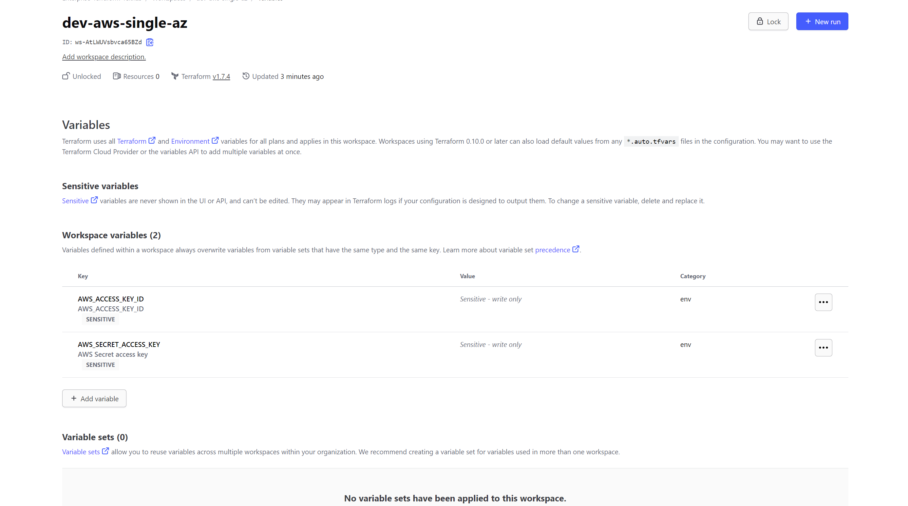
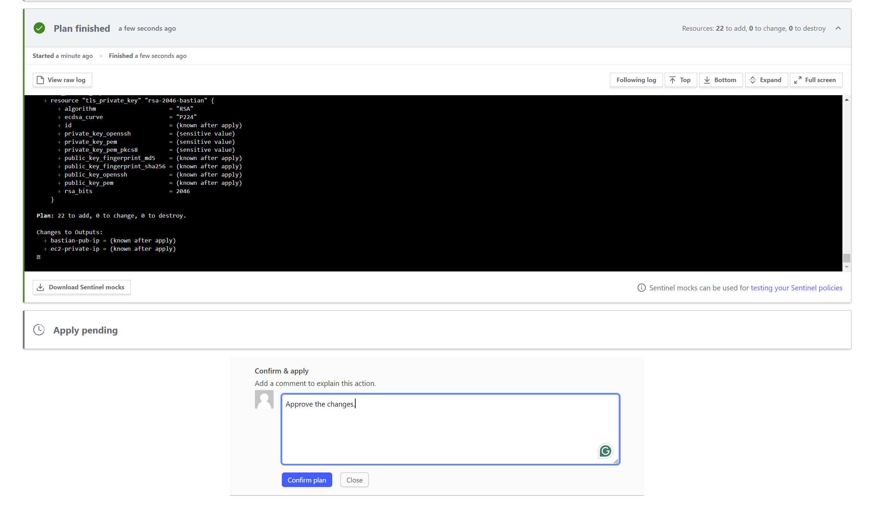

## Overview 📝
Terraform Cloud: A collaborative, scalable platform for managing infrastructure as code seamlessly. In this project we will utilize the existing aws single architecture from the existing project, but we will utilize the terraform cloud to create the architecture, the project we will use is [GITHUB](https://github.com/erom-teknas/Terraform-single-az)

## Features ✨
- **Infrastructure as Code (IaC)**: Define and manage AWS resources using Terraform configuration files.
- **Collaboration**: Work with team members on AWS architecture within Terraform Cloud, enabling version control.
- **Remote State Management**: Store and manage Terraform state files securely in Terraform Cloud.
- **Automation**: Automate basic provisioning tasks using Terraform Cloud.
- **Scalability**: Scale AWS deployments efficiently with Terraform Cloud.
- **Cost Management**: Get basic cost insights for AWS infrastructure through Terraform Cloud.

## Setup Instructions 🚧
Following are the steps for configuring and using terraform cloud:
- **Checkout Github Repository**: Check out the repositories which we are going to use for this project.
```sh
git clone https://github.com/erom-teknas/terraform-aws-simple-architecture.git
```
- **Terraform Cloud Signup/Login**: Let's create an account in terraform cloud [Terraform Cloud](https://app.terraform.io/), I am using GitHub credentials to signup to Terraform cloud. 
{: width="700" height="300" .shadow .light }
{: width="700" height="400" .shadow .dark }
- **Terraform CLI login**: Once you have created the account, you can login using the cli command, which will prompt you to create a token for login and open browser for the token createion, create token and copy it to the console.
```sh
terraform login
```
{: width="700" height="300" .shadow .light }
{: width="700" height="400" .shadow .dark }
{: width="700" height="300" .shadow .light }
{: width="700" height="400" .shadow .dark }

- **Update backend Configuration**: Update the backend configuration to use the terraform cloud as backend so that the statefile is saved in it.

```shell
#update backend block of the terraform.tf file, make sure that the organization is already created.
terraform {
  backend "remote" {
    hostname = "app.terraform.io"
    organization = "Enterprise-Terraform-Teknas"
    workspaces {
      name = "dev-aws-single-az"
    }
  }
```

```sh
terraform init
```
- **Terraform Plan**: Run terraform plan inside the repository to check the behaviour. This will fail with the following error "No Valid credentials source found"
{: width="700" height="300" .shadow .light }
{: width="700" height="400" .shadow .dark }
{: width="700" height="300" .shadow .light }
{: width="700" height="400" .shadow .dark }

- **Configure Credentials**: Now as we have changed the backend to remote, our locally configured environment secret variables are not used instead we will have to configure the secrets using the Terraform Cloud console. Goto Organization -> Workspace -> Variables (Add sensitive environment variables)
{: width="700" height="300" .shadow .light }
{: width="700" height="400" .shadow .dark }

    - Re-run terraform plan command and this time it will be successful.
```sh
terraform plan
```
{: width="700" height="300" .shadow .light }
{: width="700" height="400" .shadow .dark }

- **Apply the changes**: As the plan is now successful, run the terraform apply to apply the change to the AWS account and approve the apply using the UI.
{: width="700" height="300" .shadow .light }
{: width="700" height="400" .shadow .dark }
{: width="700" height="300" .shadow .light }
{: width="700" height="400" .shadow .dark }

- **Miscellenous**: Once the changes are applied to AWS account, you will see outputs under the overview section of the workspace.
{: width="700" height="300" .shadow .light }
{: width="700" height="400" .shadow .dark }
    - Similarly, you will see the historical runs that have been executed
{: width="700" height="300" .shadow .light }
{: width="700" height="400" .shadow .dark }
    - State file stored in the remote
{: width="700" height="300" .shadow .light }
{: width="700" height="400" .shadow .dark }

- **Destruction**: Don't forget to destroy the AWS architecture, as it might incur cost, using terraform destroy.
```sh
terraform destroy -auto-approve
```
## Resources 📚

- [Terraform Cloud](https://developer.hashicorp.com/terraform/cloud-docs)

Happy coding! 🎉