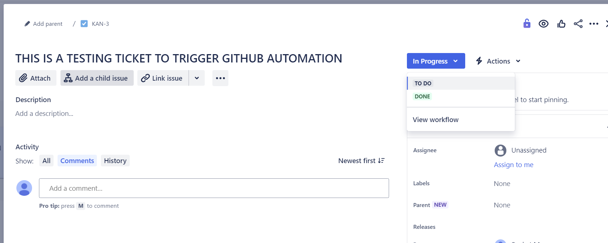

## JIRA-GITHUB Integration 🔗
Seamlessly integrate JIRA with GitHub using our 🔗 integration.

## Overview 📝
This project demonstrates a straightforward method to integrate JIRA with GitHub. Any changes made to a JIRA ticket, such as transitioning its status, will automatically trigger GitHub actions.

## Features ✨
- **Seamless Integration:** Effortlessly connect JIRA with GitHub to streamline your workflow.
- **Automated Triggering:** Automatically trigger GitHub actions in response to any changes made to a JIRA ticket.
- **Real-Time Updates:** Stay up-to-date with real-time notifications in GitHub when a JIRA ticket's status is transitioned.
- **Enhanced Collaboration:** Facilitate collaboration between development and project management teams by integrating JIRA and GitHub seamlessly.
- **Efficient Workflow:** Simplify your workflow by automating processes and reducing manual interventions between JIRA and GitHub.

## Setup Instructions 🚧
- Create PAT token under GITHUB account Goto Profile --> Developer settings --> PAT (with workflow access) and copy the PAT token and store it securely for now.
{: width="700" height="400" .shadow .light }
{: width="700" height="400" .shadow .dark }
- Now let's create the JIRA automation (Requires access to project automation) Goto JIRA project --> settings --> Automation --> Click create Rule (let's choose when issue is transitioned from in-progress to Done)
{: width="700" height="400" .shadow .light }
{: width="700" height="400" .shadow .dark }
- Add the action as send web request.
{: width="700" height="400" .shadow .light }
{: width="700" height="400" .shadow .dark }
- Configure the web request URL, the format of the github repository to invoke the workflow is below:
```sh
https://api.github.com/repos/[github-user]/[REPO]/actions/workflows/[WORKFLOW_ID]/dispatches
```
    - How to get the WORKFLOW_ID? hit the below URL in browser and you will get the workflow id
```shell
https://api.github.com/repos/[github-user]/[REPO]/actions/workflows
```
{: width="700" height="400" .shadow .light }
{: width="700" height="400" .shadow .dark }
- Configure the other settings of the JIRA Automation:
    - Set HTTP Method as POST
    - Web Request body as Custom with the following content (i.e. we are sending JIRA key number to the GITHUB request as my git repo workflow expects input)
        
        ```shell
        {
        "ref":"main",
        "inputs":{
            "issue_key": "{{ issue.key }}"
            }
        }
        ```
        
    - Configure the headers section:

        key|value|Hidden
        ---|---|---|
        Authorization|Bearer <<PAT FROM GITHUB>>|✅
        Accept|application/vnd.github+json|
        X-GitHub-Api-Version|2022-11-28
    - You can test validate by clicking on validate button, however you will need to set the "issue_key" to some hardcoded value, as you are manually triggering the automation.

      ```shell
        "issue_key": "TEST"
      ```

        > you should see status code as 204
        {: .prompt-tip }


        > Remember to revert the issue_key, so that actual JIRA key is sent to GITHUB instead of test.
        {: .prompt-warning }

    - Save the automation

## Testing 🧪

- Now let's try to check if our automation is working as expected.
- Create a ticket and move the ticket from in-progress status to Done.
{: width="700" height="400" .shadow .light }
{: width="700" height="400" .shadow .dark }
- This will trigger GITHUB-ACTIONS, go to the actions tab to verify.
{: width="700" height="400" .shadow .light }
{: width="700" height="400" .shadow .dark }
- The JIRA ticket is present in the GITHUB logs as it was printed
{: width="700" height="400" .shadow .light }
{: width="700" height="400" .shadow .dark }
## Resources 📚

- [GTHUB PAT AUTHENTICATION](https://docs.github.com/en/rest/authentication/authenticating-to-the-rest-api?apiVersion=2022-11-28#basic-authentication)

- [GITHUB DISPATCH](https://docs.github.com/en/actions/using-workflows/events-that-trigger-workflows#workflow_dispatch)

## Git repo 📁
[REPO](https://github.com/erom-teknas/jira-github-webhook)

Happy coding! 🎉