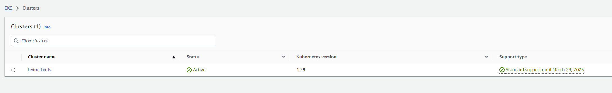
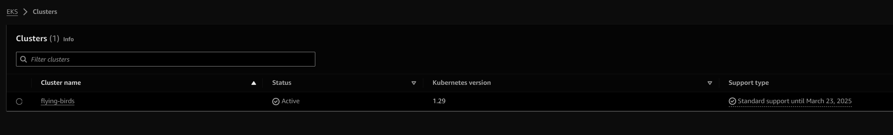
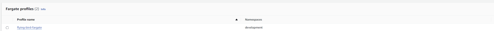
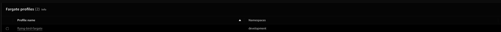
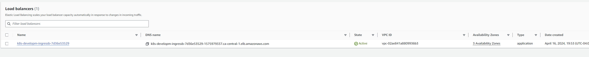
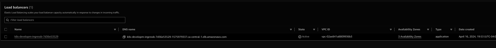

## AWS EKS 🌱
Amazon Elastic Kubernetes Service (EKS) is a managed Kubernetes service that simplifies the deployment, management, and scaling of containerized applications using Kubernetes on AWS infrastructure.

## Overview 📝
This project showcases the seamless experience of utilizing Amazon Elastic Kubernetes Service (EKS) by deploying a delightful application game called 'pod-birds' 🐦 onto the EKS cluster.

## Features ✨
**Managed Kubernetes Service:** Enjoy the benefits of a fully managed Kubernetes service with Amazon EKS, eliminating the need for manual setup and maintenance of Kubernetes control plane components, enabling you to focus on building and deploying your applications.

**Simplified Deployment with kubectl: :** Streamline the deployment process of containerized applications with Amazon EKS, using the familiar kubectl command-line tool to interact with your Kubernetes cluster.

**Integration with AWS Services:** Seamlessly integrate Amazon EKS with other AWS services such as AWS IAM and AWS LB enhancing the overall efficiency and capabilities of your Kubernetes deployment.

**Cost Optimization:**  Optimize your infrastructure costs with Amazon EKS using serverless - Fargate.

**High Availability:** Ensure high availability for your applications with Amazon EKS, leveraging multi-AZ deployment options.

## pre-requisites
- **awscli** - Command line tool for working with AWS services [here](https://docs.aws.amazon.com/cli/latest/userguide/getting-started-install.html)
- **eksctl** - Command line tool for working with EKS clusters [here](https://eksctl.io/installation/).
- **kubectl** - Command line tool for working with kubernetes API [here](https://kubernetes.io/docs/tasks/tools/).


## Setup Instructions 🚧
- Create an access key for your user and from IAM user section better to use user which has admin access.
- Configure the access key in the system using aws cli
    ```shell
    #The below command will prompt for ACCESSKEY and PASSWORD
    aws configure
    ```
- Now that the aws cli configuration setup is done, let's create the (fargate) cluster from the command line, this will take sometime:
    ```shell
    eksctl create cluster --name <your-cluster-name> --region <region> --fargate
    ```


    > This creates a VPC by itself with public/private subnet hence we don't have to manually create it.
    {: .prompt-tip }


- Let's check if the cluster is created, goto AWS EKS -> Cluster
{: width="700" height="400" .shadow .light }
{: width="700" height="400" .shadow .dark }

- Check if the kubeconfig file is having the correct details i.e. it is aws eks context, server settings. Run below to configure kube config.
    ```shell
    aws eks update-kubeconfig --region <region> --name my-cluster
    ```

- Create fargate profile to attach to the namespace
    ```shell
    eksctl create fargateprofile --cluster <your-cluster-name> --namespace development --name  flying-bird-fargate
    ```
    > If fargate profile is not created, the pods which are supposed to be deployed to development namespace, will not be deployed, it is to link the fargetprofile with the namespace.
    {: .prompt-danger }

- Fargate can be verified from the console
{: width="700" height="400" .shadow .light }
{: width="700" height="400" .shadow .dark }

- Now Let's deploy the application, it will create deployment, service and ingress
    ```shell
    curl -O https://raw.githubusercontent.com/erom-teknas/pod-birds/main/bird-pods.yml
    kubectl -f bird-pods.yaml
    ```
    > Note the ingress will not be in effect as we have not deployed the ingress controller, which we will see in below steps.
    {: .prompt-warning }

- Check if the deployment of the bird-pod is done.
    ```shell
    # You should see bird-pod-xx running
    kubectl get pods -n development
    ```
- Now let's download the IAM policy provided by aws-loadbalancer-controller.
    ```shell
    curl -O https://raw.githubusercontent.com/kubernetes-sigs/aws-load-balancer-controller/main/docs/install/iam_policy.json
    ```
- Create the policy using the iam_policy.json
    ```shell
    aws iam create-policy --policy-name AWSLoadBalancerControllerIAMPolicy --policy-document file://iam_policy.json
    ```
- Create the service account using eksctl for the aws-load-balancer-controller in EKS and a role for it, using the below command.
    ```shell
    eksctl create iamserviceaccount \
    --cluster=<your-cluster-name> \
    --namespace=kube-system \
    --name=aws-load-balancer-controller \
    --role-name AmazonEKSLoadBalancerControllerRole \
    --attach-policy-arn=arn:aws:iam::<your-aws-account-id>:policy/AWSLoadBalancerControllerIAMPolicy \
    --approve
    ```
- Install the ALB controller in the kube-system namespace for ingress to work.
    ```shell
    helm repo add eks https://aws.github.io/eks-charts
    helm install aws-load-balancer-controller eks/aws-load-balancer-controller \            
    -n kube-system \
    --set clusterName=<your-cluster-name> \
    --set serviceAccount.create=false \
    --set serviceAccount.name=aws-load-balancer-controller \
    --set region=<region> \
    --set vpcId=<your-vpc-id>
    ```
- Once the ALB controller is installed correctly, the ALB controller will create the ALB load balancer based on the rules set in the ingress object as part of (kubectl -f bird-pods.yaml)
{: width="700" height="400" .shadow .light }
{: width="700" height="400" .shadow .dark }
## Testing 🧪
- Verify using the ALB URL if you are able to access the browser
{: width="700" height="400" .shadow .light }
{: width="700" height="400" .shadow .dark }
## Resources 📚
- [AWS EKS](https://docs.aws.amazon.com/eks/latest/userguide/getting-started.html)

## Git repo 📁
[REPO](https://github.com/erom-teknas/pod-birds)