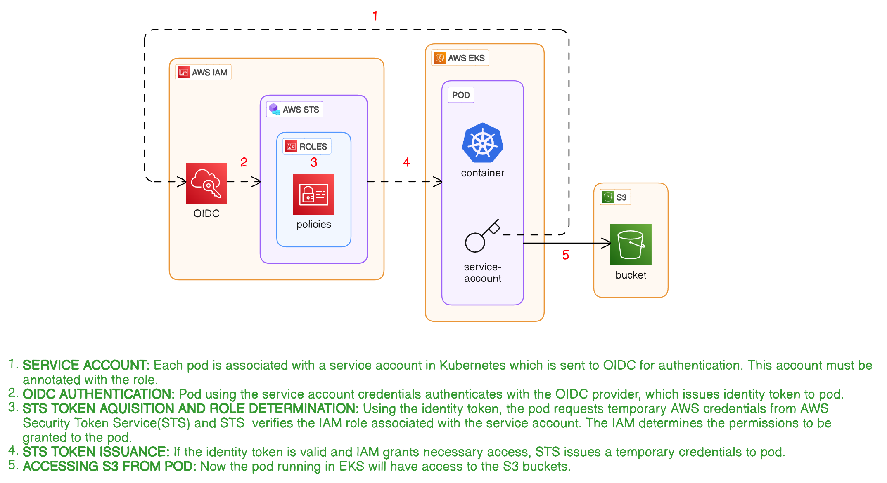
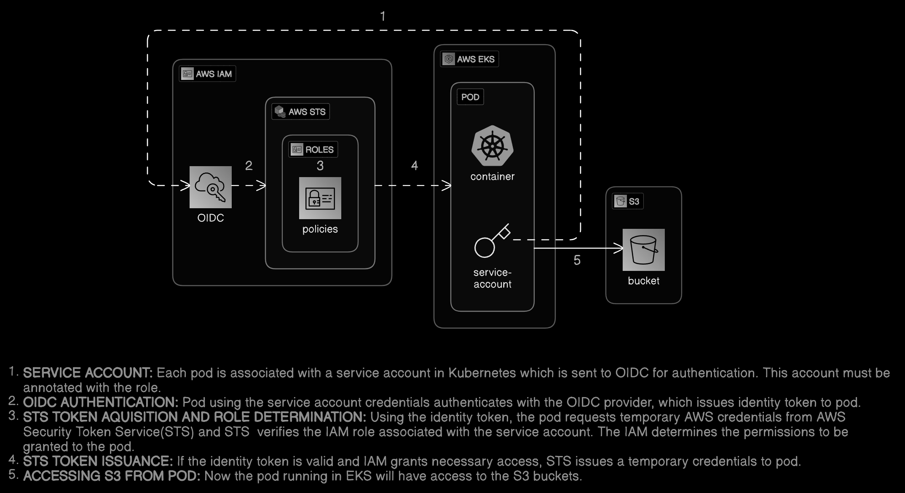
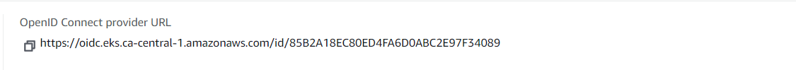
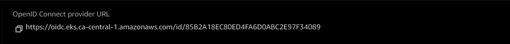
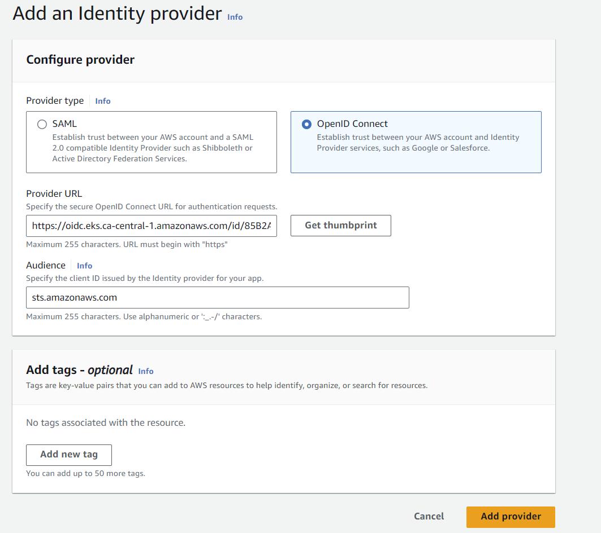
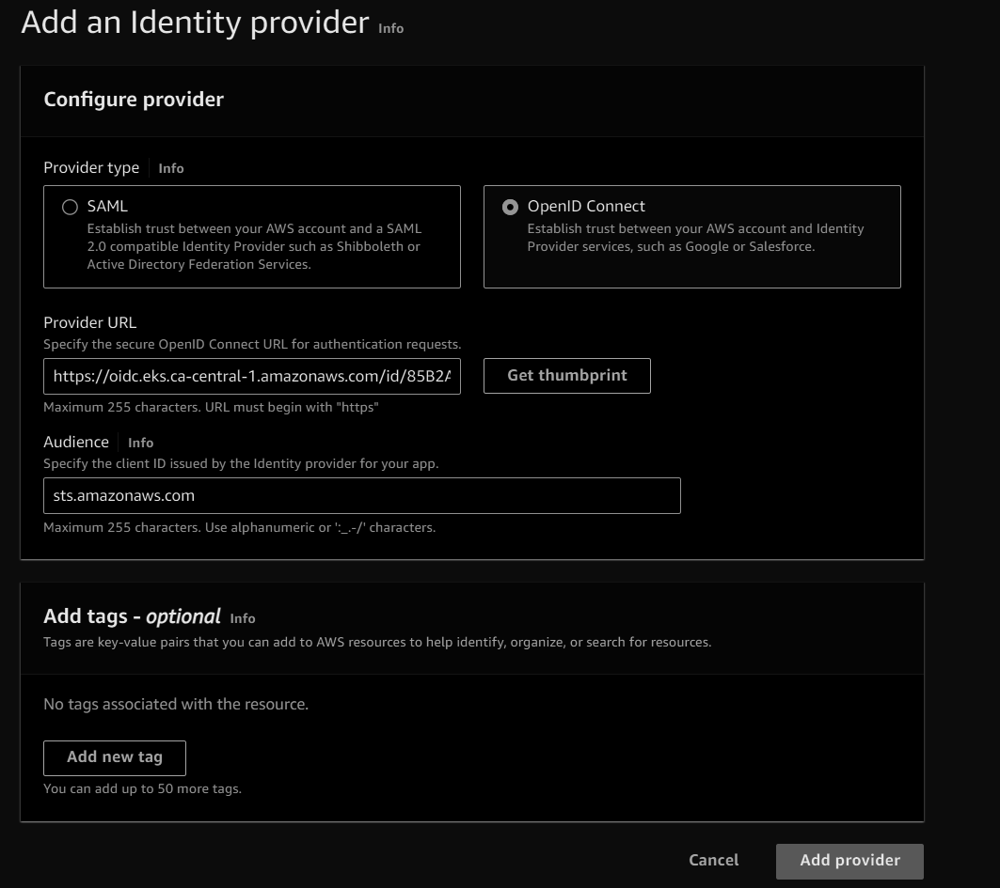
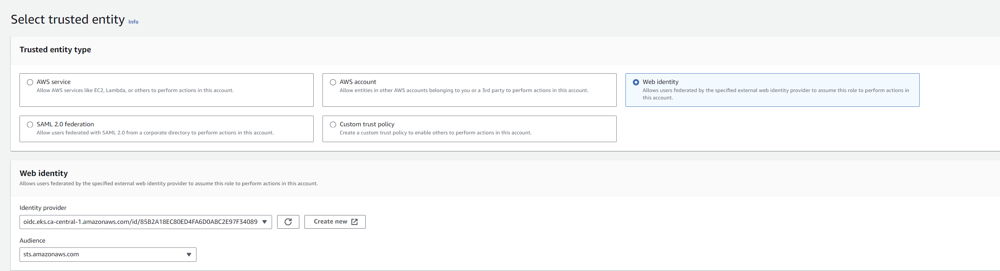
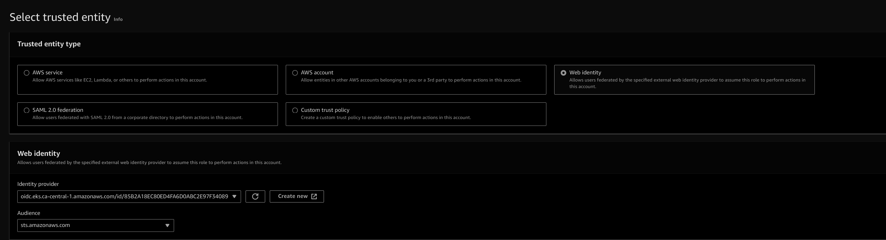
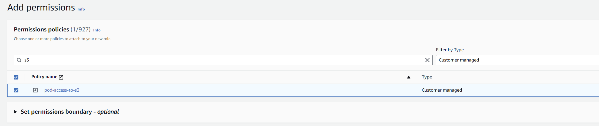
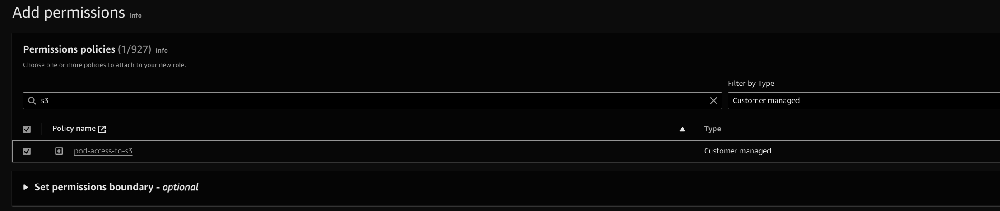

## AWS EKS Pods Access to AWS Services🌱
There are instances where EKS Pods needs access to AWS services like S3, this tutorial talks about the different services like serviceaccounts, OIDC provider, IAM roles/policies and STS used to accomplish this goal.

## Overview 📝
{: width="700" height="400" .shadow .light }
{: width="700" height="400" .shadow .dark }

## Setup Instructions 🚧
- Create a dummy S3 bucket in your specific region, I am creating it in ca-central-1.
    ```shell
    aws s3api create-bucket \
    --bucket my-bucket-dummy-eks \
    --region ca-central-1 \
    --create-bucket-configuration LocationConstraint=ca-central-1
    ```
- Create the EKS cluster using the below command which has EC2 nodes as cluster nodes. (It takes approximately 15 minutes for the cluster creation)
    ```shell
    eksctl create cluster --name demo-s3-cluster --region ca-central-1 --with-oidc --nodes 2 --instance-types=t2.micro
    ```
- Once cluster is created, run a kubectl command to get nodes, you should see the EC2 nodes.
    ```shell
    kubectl get nodes -o=wide
    ```
- Let's create the OIDC provider, policies and roles from the console for the EKS cluster (Note: by default it will be create if you use the above EKS creation command)
    - Go to the EKS console and get the OIDC provider URL of the cluster
{: width="700" height="400" .shadow .light }
{: width="700" height="400" .shadow .dark }
    - Configuring the OIDC provider using IAM console (IAM console > Access Management > Identity Providers > Add providers)
{: width="700" height="400" .shadow .light }
{: width="700" height="400" .shadow .dark }
    - Create policy to grant access to S3 buckets (IAM console > Access Management > Policies ), I have named it as pod-access-to-s3.
        ```shell
        {
            "Version": "2012-10-17",
            "Statement": [
                {
                    "Sid": "VisualEditor0",
                    "Effect": "Allow",
                    "Action": [
                        "s3:ListBucket",
                        "s3:ListAllMyBuckets"
                    ],
                    "Resource": "*"
                }
            ]
        }
        ```
    - Create a role and attach the policy created above to it, create the role as per below screenshot
{: width="700" height="400" .shadow .light }
{: width="700" height="400" .shadow .dark }
{: width="700" height="400" .shadow .light }
{: width="700" height="400" .shadow .dark }
        - Make sure that the trusted policy is as mentioned below, it includes the service account name (which we are yet to create) and the OIDC ID which was created above
        ```shell
        {
            "Version": "2012-10-17",
            "Statement": [
                {
                    "Effect": "Allow",
                    "Principal": {
                        "Federated": "arn:aws:iam::<<ACCOUNTID>>:oidc-provider/oidc.eks.ca-central-1.amazonaws.com/id/<<OIDC ID>>"
                    },
                    "Action": "sts:AssumeRoleWithWebIdentity",
                    "Condition": {
                        "StringEquals": {
                            "oidc.eks.ca-central-1.amazonaws.com/id/<<OIDC ID>>:aud": "sts.amazonaws.com",
                            "oidc.eks.ca-central-1.amazonaws.com/id/<<OIDC ID>>:sub": "system:serviceaccount:<<NAME SPACE>>:<<SERVICE-ACCOUNT>>"
                        }
                    }
                }
            ]
        }        
        ```

- Let's create a pod and service account attached to it in the default namespace.
    - Service account needs to be annotated with the role that we have created above:
    ```shell
    apiVersion: v1
    kind: ServiceAccount
    metadata:
    annotations:
            eks.amazonaws.com/role-arn: 
                    arn:aws:iam::891377161155:role/pod-access-s3-role
    name: sa-access-s3
    namespace: default
    ```
    - Create a Pod which will use the above service account.

        ```shell
        apiVersion: v1
        kind: Pod
        metadata:
        creationTimestamp: null
        labels:
                run: access-s3-pod
        name: access-s3-pod
        spec:
        containers:
        - args:
                - help
        image: amazon/aws-cli
        name: access-s3-pod
        serviceAccount: sa-access-s3
        ```
    - Once the pod is create run the below command to make sure that the Pod has the web identity token file mount.
        ```shell
        kubectl describe pod access-s3-pod | grep AWS_WEB_IDENTITY_TOKEN_FILE:

        #Example output
        #AWS_WEB_IDENTITY_TOKEN_FILE:  /var/run/secrets/eks.amazonaws.com/serviceaccount/token
        ```
## Testing 🧪
- Let's test and see if the pod can now access the S3 bucket or not.
    ```shell
    kubectl exec -it access-s3-pod -- sh
    #Run the aws s3 ls to list the buckets
    aws s3 ls
    #You will see the buckets that are present in your account
    #2024-04-20 18:28:50 my-bucket-dummy-eks
    #2024-04-20 17:16:38 s3-bucket-eks-demo
    ```
## Cleanup 🧹
- Make sure to delete the cluster.
    ```shell
    eksctl delete cluster --name demo-s3-cluster
    ```
## Resources 📚
- [AWS EKS](https://docs.aws.amazon.com/eks/latest/userguide/getting-started.html)