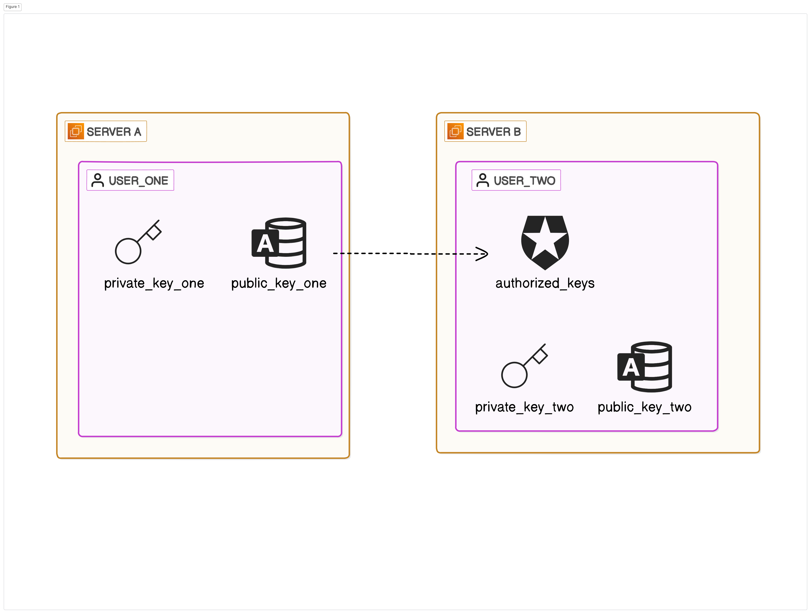
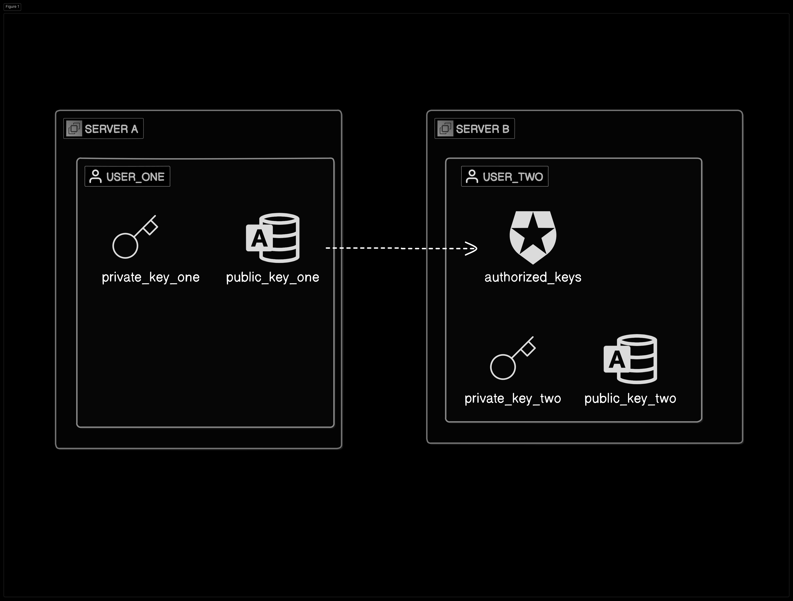

## Overview 📝
This documentation talks about the various commands that are used as part of Linux administration in day 2 day activities.

## Pre-requisite Setup Instructions 🚧
Download Oracle VM Virtual Box from [Click here](https://www.virtualbox.org/wiki/Downloads).<br>
Download RedHat Linux ISO [Click here](https://access.redhat.com/downloads/content/479/ver=/rhel---8/8.4/x86_64/product-software).<br>

## Important Commands ⌨️
- Adding a User
    - Add Operation
        ```shell
        useradd ant
        ```
    - Verification, check if a folder ant is created in the /home directory
        ```shell
        cd /home/
        ls ant
        ```
- Adding a Group
    - Add Operation
        ```shell
        groupadd insects
        ```
    - Verification, check if an entry is present in /etc/group file
        ```shell
        cat /etc/group | grep insects
        ```
- Assigning User to Group
    - Modify User
        ```shell
        usermod -G insects ant
        ```
    - Verify if User is added to the Group
        ```shell
        cat /etc/group | grep insects
        #insects:x:1004:ant
        #group:encryptedpasswd:groupid:userid
        ```
- Checking Different files under /etc
    - passwd [UserFile]
        ```shell
        cat /etc/passwd | grep ant
        #ant:x:1002:1003::/home/ant:/bin/bash
        #user:encryptedpasswd:userid:groupid:homedirectory:shell
        ```
    - group [GroupFile]
        ```shell
        cat /etc/group | grep ant
        #insects:x:1004:ant
        #group:encryptedpasswd:groupid:userid
        ```
    - shadow [PasswordFile]
        ```shell
        cat /etc/shadow | grep ant
        #ant:!!:19835:0:99999:7:::
        ```
- One line command to create the User and Assign it to a Group
    - Create User and add to Group
        ```shell
            useradd -G insects -s /bin/bash -c "This is a bug" -m -d /home/bug bug
            # -G GROUP
            # -s SHELL
            # -c COMMENT
            # -m CREATE HOME DIRECTORY
            # -d HOME DIRECTORY
        ```
    - Create password for the User
        ```shell
        passwd bug
        ```
    - Verification
        ```shell
        cat /etc/shadow | grep bug
        #bug:$6$tipJYGx11g3arh2U$R7nEyhEIy90wDEtPf32Zr4T0EWHVtcrH6I6h1Nd8IpRbrHd1v4mc1Mbn4XY2A.If/OuCnW.BPshjbOLL1uIMv1:19835:0:99999:7:::
        #This is an encrypted password in shadow file

        cat /etc/passwd | grep bug
        #bug:x:1003:1005:This is bug:/home/bug:/bin/bash

        cat /etc/group | grep bug
        #insects:x:1004:ant,bug
        ```
- Delete User, Group
    - User
        ```shell
        userdel -r ant
        #Remove home directory as well
        groupdel insects
        ```
- Changing Password policy
    - Per User
        ```shell
        chage -m mindays -M maxdays -d lastday -I inactive -E expiredate -W warndays user
        #bug:$6$tipJYGx11g3arh2U$R7nEyhEIy90wDEtPf32Zr4T0EWHVtcrH6I6h1Nd8IpRbrHd1v4mc1Mbn4XY2A.If/OuCnW.BPshjbOLL1uIMv1:19835:0:99999:7:::

        #So from the above let's consider the following 19835:0:99999:7::: 
        # -d lastday: days since 1 Jan 1970 the password was change so we see 19835 days (April 22, 2024).
        # -m mindays: After how many days can a user change the password, currently no restriction hence 0, if set to 5, the User can change password after 5 days.
        # -M maxdays: After how many days User should be prompted to change password, Current is 99999 that is alot, hence we have to change it to something meaningful.
        # -W warning: Warn User when password is going to expire.
        # -I Inactive: Set User as inactive after number of days Password expires.
        # -E Expire: Days after which the User to expire from 1 Jan 1970.

        #Let's apply this to the user bug using chage
        chage bug -m 5 -M 90 -W 10 -I 3 
        #bug:$6$tipJYGx11g3arh2U$R7nEyhEIy90wDEtPf32Zr4T0EWHVtcrH6I6h1Nd8IpRbrHd1v4mc1Mbn4XY2A.If/OuCnW.BPshjbOLL1uIMv1:19835:5:90:10:3::
        ```
    - All Users 
        ```shell
        cat /etc/login.defs
        #PASS_MAX_DAYS   99999
        #PASS_MIN_DAYS   0
        #PASS_MIN_LEN    5
        #PASS_WARN_AGE   7
        #UMASK 077
        ```
- Sudo Commands
    - Switch User to root
        ```shell
        su
        #Prompts for root password
        ```
    - Switch User to bug
        ```shell
        su bug
        ```
    - Add users to sudoer group using wheel Group to execute certain commands like dmidecode which are accessible only to root
        ```shell
        usermod -aG wheel smore

        #Test using the sudo command
        sudo dmidecode
        sudo fdisk -l
        ```
- Other important commands - Monitoring and Manage processes 

    -   Filesystem Usage
        ```shell
        df -h
        #h is human readable format
        ```
    -   Disk Usage
        ```shell
        du -h
        #Details of each file in the filesystem
        ```
    -   Check system uptime
        ```shell
        uptime
        #Gives basic information like since when is the system up and running etc.
        ```
    -   Checking processes running in server
        ```shell
        top
        ```
    -   Check the swap and memory
        ```shell
        free
        ```
    -   Check list of open files
        ```shell
        lsof
        ```
    -   Networking command, incoming network
        ```shell
        tcpdump -i enp0s3
        ```
    -   Network statistics using netstat
        ```shell
        netstat
        ```
    -   Check processes runnning using ps -ef
        ```shell
        ps -ef | grep java
        ```
    -   Force kill a process using kill command
        ```shell
        kill -9 47474
        ```
- Controlling Services and daemons using systemctl
    -   Get all the services running
        ```shell
        systemctl --all
        ```
    -   Check a particular service status
        ```shell
        systemctl status firewalld.service
        ```
    -   Stop the service - i.e. it will change the status to inactive
        ```shell
        systemctl stop firewalld.service
        ```
    -   Restarting the firewall service 
        ```shell
        systemctl restart firewalld.service
        ```
    -   Reload the cofiguration of the service
        ```shell
        systemctl reload firewalld.service
        #Reload the config without impacting the service
        ```
    -   Configure the service to start during linux start time and vice-versa
        ```shell 
        systemctl enable firewalld.service
        #This will add the service to start at restart
        systemctl disable firewalld.service
        #This will remove from the startup list
        ```
    -   Prevent accidental starts of the service by masking the service
        ```shell
        systemctl mask firewalld.service
        #The service is masked now you wont be able to start it until it is unmasked.
        systemctl unmask firewallId.service
        ```
- Secure SSH login using keys
    - If Machine A wants to login to Machine B without providing username/password.
        -   Generate the key pair in Machine A
            ```shell
            ssh-keygen
            #Enter password if you want to else you can ignore
            cd /home/usera/.ssh
            #You will find two new files, id_rsa.pub [public key] and id_rsa [private key], copy the public key
            ```
        -   Copy the public key of the USER ONE from Machine A to Machine B USER TWO's authorized_keys file
            ```shell
            cd /home/userb/.ssh
            #Login to server B, as USET TWO
            vi authorized_keys
            #Create a new file if not present and paste the content of public key copied in the above step
            ```
{: width="700" height="400" .shadow .light }
{: width="700" height="400" .shadow .dark }


## Resources 📚
- [RedHat Doc](https://access.redhat.com/documentation/en-us/red_hat_enterprise_linux/8/html/configuring_basic_system_settings/index)