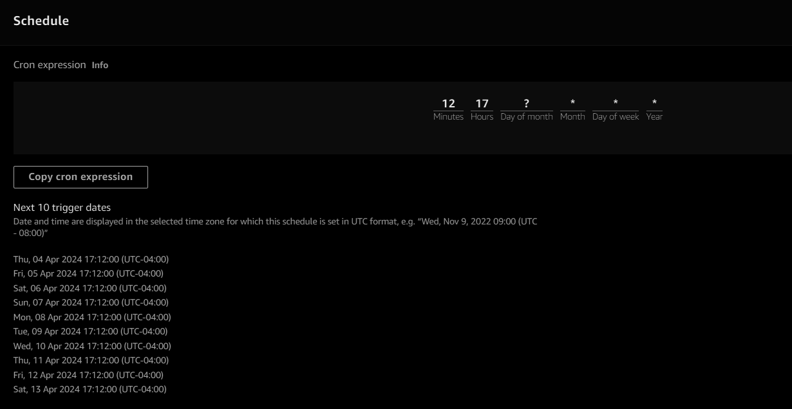

# Cost Optimization in AWS 💲
Achieve efficient resource allocation and maximize cost-effectiveness in your AWS infrastructure.

## Overview 📝
This project provides step by step guide to effectively shutdown the development EC2 instances which are not going to be used after hours and start them during weekdays at 8:00 AM
{: width="700" height="400" .shadow .light }
{: width="700" height="400" .shadow .dark }
## Features ✨

- **Automated EC2 Management**: Utilize AWS Lambda functions triggered by Amazon EventBridge to automatically start and stop your EC2 instances at specific times, such as 8:00 am and 6:00 pm.
- **Event-Driven Workflow**: Set up EventBridge rules to trigger Lambda functions based on scheduled events, enabling seamless automation of EC2 instance management tasks.
- **Notification Alerts**: Upon successful start and stop actions of EC2 instances, trigger additional events to send notifications to an Amazon SNS topic, keeping stakeholders informed about the status of instance operations.


## Setup Instructions 🚧
Following are the steps to setup automated EC2 management system using AWS Lambda, Amazon EventBridge, and Amazon SNS:
- **VPC**: Let's create a VPC, with a public, private subnet, a internet gateway and nat gateway.
{: width="700" height="400" .shadow .light }
{: width="700" height="400" .shadow .dark }
- **EC2 Instances**: Create EC2 instances that you want to manage automatically(in private subnet). Note down the instance tags (env:dev) that will be used to identify these instances in your Lambda functions.
{: width="700" height="400" .shadow .light }
{: width="700" height="400" .shadow .dark }
- **Lambda Functions**: Create Lambda functions responsible for starting and stopping EC2 instances. These functions will be triggered by EventBridge rules based on scheduled events.
    - stop-ec2-dev-instance
{: width="700" height="400" .shadow .light }
{: width="700" height="400" .shadow .dark }
{: width="700" height="400" .shadow .light }
{: width="700" height="400" .shadow .dark }

    ```python
    import boto3
    def lambda_handler(event, context):
        print("Starting Lambda function execution...")
        
        # Initialize the EC2 client
        print("Initializing EC2 client...")
        ec2_client = boto3.client('ec2')
        
        # Define the tag key-value pair to filter instances
        tag_key = 'env'
        tag_value = 'dev'
        
        try:
            print("Describing EC2 instances with the specified tag...")
            # Describe EC2 instances with the specified tag
            response = ec2_client.describe_instances(
                Filters=[
                    {'Name': 'instance-state-name', 'Values': ['running']},
                    {'Name': f'tag:{tag_key}', 'Values': [tag_value]}
                ]
            )
            
            # Check if there are running instances with the specified tag
            if 'Reservations' in response and len(response['Reservations']) > 0:
                print("Running instances found with the specified tag. Printing details...")
                # Iterate over reservations and stop instances
                for reservation in response['Reservations']:
                    for instance in reservation['Instances']:
                        instance_id = instance['InstanceId']
                        instance_type = instance['InstanceType']
                        private_ip = instance['PrivateIpAddress']
                        print(f"Stopping instance: {instance_id}, Type: {instance_type}, Private IP: {private_ip}")
                        # Stop the instance
                        ec2_client.stop_instances(InstanceIds=[instance_id])
                        
                        # Wait until instance state changes to stopped
                        waiter = ec2_client.get_waiter('instance_stopped')
                        waiter.wait(InstanceIds=[instance_id])
                        
                        print(f"Instance {instance_id} stopped successfully.")
            else:
                print("No running instances found with the specified tag.")
        
        except Exception as e:
            print(f"An error occurred: {e}")

        print("Lambda function execution completed.")

    # Uncomment the line below for testing locally
    # lambda_handler(None, None)
```
    - start-ec2-dev-instance: Create a lambda function in the same VPC as EC2 and in the private subnet.
{: width="700" height="400" .shadow .light }
{: width="700" height="400" .shadow .dark }
{: width="700" height="400" .shadow .light }
{: width="700" height="400" .shadow .dark }

    ```python
    import boto3
    def lambda_handler(event, context):
    print("Starting Lambda function execution...")
    
    # Initialize the EC2 client
    print("Initializing EC2 client...")
    ec2_client = boto3.client('ec2')
    
    # Define the tag key-value pair to filter instances
    tag_key = 'env'
    tag_value = 'dev'
    
    try:
        print("Describing EC2 instances with the specified tag...")
        # Describe EC2 instances with the specified tag
        response = ec2_client.describe_instances(
            Filters=[
                {'Name': 'instance-state-name', 'Values': ['stopped']},
                {'Name': f'tag:{tag_key}', 'Values': [tag_value]}
            ]
        )
        
        # Check if there are stopped instances with the specified tag
        if 'Reservations' in response and len(response['Reservations']) > 0:
            print("Stopped instances found with the specified tag. Printing details...")
            # Iterate over reservations and start instances
            for reservation in response['Reservations']:
                for instance in reservation['Instances']:
                    instance_id = instance['InstanceId']
                    instance_type = instance['InstanceType']
                    private_ip = instance['PrivateIpAddress']
                    print(f"Starting instance: {instance_id}, Type: {instance_type}, Private IP: {private_ip}")
                    # Start the instance
                    ec2_client.start_instances(InstanceIds=[instance_id])
                    
                    # Wait until instance state changes to running
                    waiter = ec2_client.get_waiter('instance_running')
                    waiter.wait(InstanceIds=[instance_id])
                    
                    print(f"Instance {instance_id} started successfully.")
        else:
            print("No stopped instances found with the specified tag.")
    
    except Exception as e:
        print(f"An error occurred: {e}")

    print("Lambda function execution completed.")
# Uncomment the line below for testing locally
# lambda_handler(None, None)
    ```

- **Amazon EventBridge Rules**: Set up EventBridge rules to schedule triggering of Lambda functions at specific times (e.g., 8:00 am and 6:00 pm) to start and stop EC2 instances.
    - start-ec2-dev-instance:
{: width="700" height="400" .shadow .light }
{: width="700" height="400" .shadow .dark }
{: width="700" height="400" .shadow .light }
{: width="700" height="400" .shadow .dark }
    - stop-ec2-dev-instance:
{: width="700" height="400" .shadow .light }
{: width="700" height="400" .shadow .dark }
{: width="700" height="400" .shadow .light }
{: width="700" height="400" .shadow .dark }
- **Amazon SNS Topic**: Create an SNS topic to which notification alerts will be sent upon successful start and stop actions of EC2 instances. Obtain the ARN (Amazon Resource Name) of this topic for use in your Lambda functions.
    - For this we will reuse the same eventbridge we have created  [here]() (section **AWS EventBridge** 🎉)

- **Result**: EC2 is shut down after office hours and email notification is sent about the EC2 event shutown
{: width="700" height="400" .shadow .light }
{: width="700" height="400" .shadow .dark }
{: width="700" height="400" .shadow .light }
{: width="700" height="400" .shadow .dark }
### IAM Role Configuration (Points to remember)
- 🤝 Create an IAM role with permissions of Lambda to Cloudwatch, EC2 and VPC.
- 📜 Attach the IAM role to eventbridge to call the lambda functions.

## Resources 📚

- [AWS Lambda Documentation](https://docs.aws.amazon.com/lambda/)
- [Amazon EventBridge Documentation](https://docs.aws.amazon.com/eventbridge/)
- [Amazon SNS Documentation](https://docs.aws.amazon.com/sns/)

## Acknowledgements 🙏

Special thanks to the amazing communities AWS for their fantastic tools and resources.

Happy coding! 🎉

## GITHUB Repository 
[GITHUB](https://github.com/erom-teknas/aws-cost-optimization)
