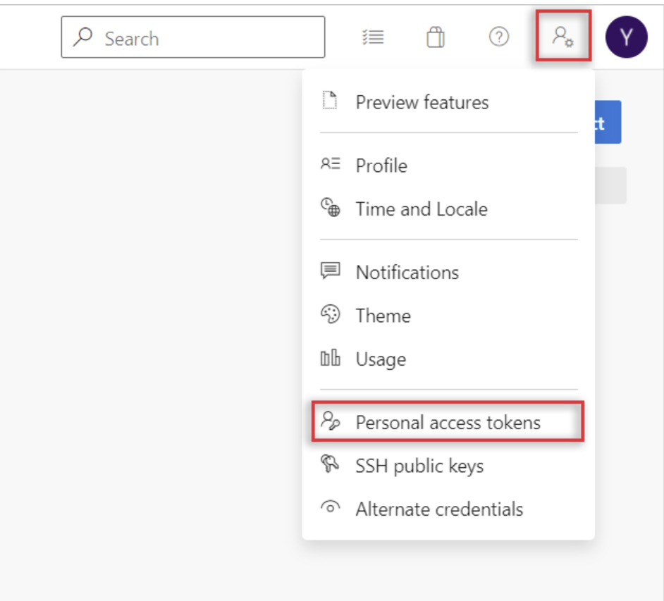
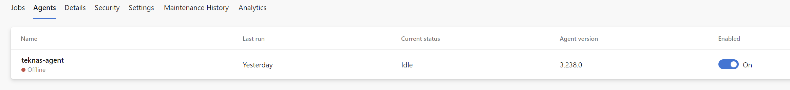
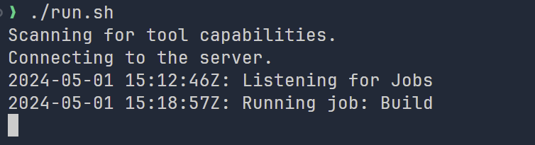

## Overview 📝
This documentation gives the details of steps to be followed for configuring self hosted agents for Azure pipelines.

## Pre-requisite  🚧
Already have Azure pipeline account / organization.
WSL Ubuntu is installed in your windows machine or using Ubuntu out of the box to be used as self-hosted agent.

## Setup Instructions 🚧
- Login to Azure devOps portal [here](https://dev.azure.com)
- Goto organization settings present on the bottom left.
- Goto pipelines --> Agent pools --> Click Default and New Agent.
- Click on the Linux tab from the options, as in my case I want to install the agent in my WSL Ubuntu system.
- Click on Download the agent, it will download (current version)
    ```shell
    vsts-agent-linux-x64-3.238.0.tar.gz
    ```
- Move the downloaded archive to /tmp folder, in my case it was downloaded under /mnt/h/downloads
    ```shell
    mkdir -p ~/tmp
    mv /mnt/h/downloads/vsts-agent-linux-x64-3.238.0.tar.gz ~/tmp
    ```
- Follow the instructions on the tab (under Linux)
    ```shell
     cd ~
     mkdir myagent && cd myagent
     tar zxvf ~/tmp/vsts-agent-linux-x64-3.238.0.tar.gz
    ```
- Create PAT token from your Azure pipeline Organization following the below screenshots.
    > Don't forget to keep the copy of PAT token somewhere securely in your system.
    {: .prompt-warning }
{: width="700" height="400" .shadow .light }
{: width="700" height="400" .shadow .dark }
{: width="700" height="400" .shadow .light }
{: width="700" height="400" .shadow .dark }
- Go back to the Ubuntu command line and run the configuration script.
    > Once you run configuration it will prompt for PAT token and other details like Agent-name and Agent-pool etc, give any name but keep it default for other options.
    {: .prompt-info }
    ```shell
    #Server URL: https://dev.azure.com/{your-organization}
    cd ~/myagent
    ./config.sh
    ```
- That's it now you should see the agent under your Default Agent pool but in offline state.
        {: width="700" height="400" .shadow .light }
        {: width="700" height="400" .shadow .dark }
- Now you can start the agent using the run script.
    ```shell
    cd ~/myagent
    ./run.sh
    ```

{: width="700" height="400" .shadow .light }
{: width="700" height="400" .shadow .dark }

- That's it now you have your own agent running, you can use this to build artifacts, in my case I wanted to build npm project, so installed npm
    ```shell
    sudo apt install npm
    ```
- Try building the project with Azure pipelines, with pool configured as default. example:

    ```yaml
    trigger: 
    - main

    pool: 
    name: default
    stages:
    - stage: "Build_stage"
    jobs:
    - job: "Build"
        steps:
        - task: Npm@1
        inputs:
            command: 'install'
    ```
- Now try running the build manual using the run button of the pipeline and check the status of the build in your agent run session.
{: width="700" height="400" .shadow .light }
{: width="700" height="400" .shadow .dark }
- Congratulations, you have configured your own self-hosted runner for builds.
## Resources 📚
- [Azures Docs](https://learn.microsoft.com/en-us/azure/devops/pipelines/agents/linux-agent?view=azure-devops)